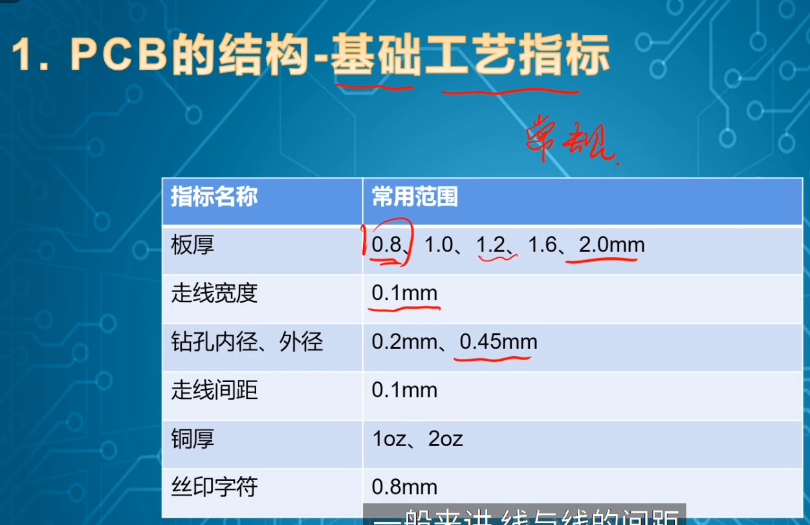

- [PCB基础扫盲](https://www.bilibili.com/video/BV1GU4y1N7Z6/?share_source=copy_web&vd_source=b8094b4f8fa8fe4e8a90bcc3b78009fb)
 > 
 > - 👆 常用的不用加价的PCB板指标
 > - 元件是从网上下载或手动绘制导入元件库的，总之是某人画出来的
 > - 布局是器件之间的摆放关系
 >      - 由信号的走向...
 >      - ...和前后板的连接关系，这两个因素决定
 > - 布线就是连线
 >      - 走线弯弯曲曲是为了走线等长，一般是在高速情况下这么做
 > - 叠层：
 >      - 两层板不用叠层，四层板稍微有一点，到六层板开始就要开始叠层设计，也就是确定各层板的功能了 
 > 
 >      - 四层板：信号 - 地 - 电源 - 信号
 >      - 四层板最方便最简单，两层板反而难一点，但是学的时候还是从2层开始画，才会明白为什么4层简单
 > - 设计依据：原理图（电路图），原理图有三个要素
 >      - 元器件
 >      - 连线
 >      - 网名（引脚上的名字，线头上的那个）
 > 
 > 厂家打印需求的文件：
 >  - 比较懒，项目也不保密：直接发pcbdoc，.brd，.pcbdoc就行
 >  - 有保密需求：GERBER
 > 
 > 这个流程中越靠前要求经验越多，一般是从建库开始学